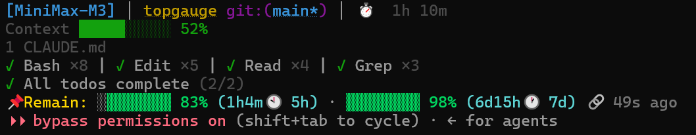
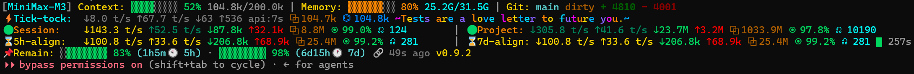

<pre>
[upstream statusline lines]
Usage: ▓▓▓▓░░░░ 40% (1h27m🕗 5h) · ▓▓░░░░░░ 20% (4d3h🕔 7d)    # Quota
Balance: ￥110.00 · $3.5                                        # Balance
</pre>

# ToPGauge

[](LICENSE)
[](https://github.com/cwf818/topgauge/tags)
[](https://github.com/cwf818/topgauge/stargazers)

A provider-agnostic Claude Code statusline plugin for **token-plan usage / remaining quota**. It picks what to render from `ANTHROPIC_BASE_URL`, so the same plugin works against any supported provider's plan endpoint — no per-provider re-install. Currently supported:

- **MiniMax** — `Usage: …` / `Remain: …` (5-hour + weekly windows), from `/v1/token_plan/remains`
- **DeepSeek** — `Balance: …` (account balance), from `/user/balance`

For vanilla Anthropic, OpenRouter, or any other provider not on the list above, the plugin **hides itself** and passes any chained upstream statusline through unchanged.

We deliberately don't reimplement the kitchen-sink statuslines that already exist for vanilla Anthropic — [`claude-hud`](https://github.com/jarrodwatts/claude-hud) and [`ccstatusline`](https://github.com/sirmalloc/ccstatusline) cover that. This plugin focuses on provider-specific **quota / balance** data, plus lightweight usage statistics read from Claude Code's stdin payload.

ANSI colors are 5-band (256-color SGR): bright green / dark green / yellow / orange / red. Applied to the displayed value + the colored bar segment; the empty part of the bar stays uncolored so it remains readable.

## Snapshots

**Simple preset** (default `statuslineTemplate`, working with a pre-installed `claude-hud`) — minimal layout, single Remain line on its own:



**Standard preset** — context, memory, git, session / project / 5h-align / 7d-align scanners, m_statTtlStatus tail, plus the live quota line:



## Documentation

- [**MANUAL.md**](./MANUAL.md) — exhaustive configuration reference. Top-level schema, provider entries, presets, fragments, inline-args grammar, full `m_*` module catalog, recipes, plugin ABI.
- [**HOW_TO_CREATE_A_PLUGIN.md**](./HOW_TO_CREATE_A_PLUGIN.md) — wire up a custom provider (kimi / moonshot / z.ai / etc.) without forking the plugin. User-side plugin ABI, fill contract, override resolution.
- [**CHANGELOG.md**](./CHANGELOG.md) — per-version change history (breaking changes, new modules, removed aliases, schema upgrades).

## Install

The plugin is a single-plugin marketplace. Install it in three steps:

```
/plugin marketplace add cwf818/topgauge
/plugin install topgauge@topgauge
```

> After the plugin install, run `/reload-plugins` so the loader picks up the new commands before wiring it into `settings.json`. Forgetting this step is the most common cause of "command not found" right after install.

Then wire it into `settings.json`:

```
/topgauge:install
```

This patches the active `settings.json` (user-level by default; pass `--project` for project-level):

1. If `statusLine` is already managed by us (`_topgauge_managed: true`), the command is a no-op.
2. Otherwise, the current `settings.json` is backed up to `settings.json.bak.<ISO-timestamp>`.
3. The original `statusLine.command` is preserved at `<claude-root>/plugins/topgauge/state/upstream-cmd.sh` and `<claude-root>/plugins/topgauge/state/upstream-cmd.txt` — sibling of `config.json`, **stable** across `/plugin install` rolls and cache wipes.
4. The `statusLine` is rewritten to invoke our wrapper, which sets `TOPGAUGE_UPSTREAM_CMD=<upstream-cmd.sh>` so the original statusline runs above our line.

`install.sh` auto-builds `dist/index.js` if it's missing (the marketplace install only copies source, not the bundle). Re-running the slash command is always a no-op once installed.

If you want to preview what install will do, run `/topgauge:install --dry-run` first.

If your active `settings.json` doesn't exist at the project level, install creates a minimal one (with `permissions.defaultMode: bypassPermissions`). It does **not** copy from the user-level file.

### Restore from backup

```
/topgauge:install --restore
```

Replaces the active `settings.json` with the most recent `settings.json.bak.<ts>`. Useful if you want to roll back an edit that wasn't made by us.

## Commands

Four slash commands ship with the plugin:

| Command                       | What it does                                                              |
| ----------------------------- | ------------------------------------------------------------------------- |
| `/topgauge:install`           | Wire the wrapper into `settings.json` (or `--restore`).                  |
| `/topgauge:uninstall`         | Restore `settings.json`, wipe cache + marketplace + loader rows.         |
| `/topgauge:clean`             | Trim old `.bak.<ts>` files (keeps the most recent per file).             |
| `/topgauge:clean-cache`       | Remove stale version dirs from the plugin cache, keeping only the newest. |

Each is a Pattern B2 slash command — the body is a `!`-fenced shell block that loads `scripts/<name>.sh` directly via `${CLAUDE_PLUGIN_ROOT}`, with `allowed-tools` scoped to that script. See [Project layout](#project-layout) for the file map.

## Uninstall

```
/topgauge:uninstall
```

This is a self-contained cleanup that works even after the plugin's cache and marketplace have been wiped. It does all of the following:

1. **Restore `statusLine`** — strategy in order:
   - If `${CLAUDE_ROOT}/plugins/topgauge/state/upstream-cmd.txt` exists (the stable state dir, sibling of `config.json`), restore the original command byte-for-byte from that file.
   - Else, fall back to the most recent `settings.json.bak.<ts>` whose `statusLine` does **not** have `_topgauge_managed: true` (the state before the plugin was installed).
   - Else, strip the marker but leave the wrapper in place and print a warning.
2. **Remove `topgauge@topgauge` from `settings.json.enabledPlugins`** (other plugins preserved).
3. **Remove `topgauge` from `settings.json.extraKnownMarketplaces`** (Claude Code records the marketplace source there too — leaving it would re-add the marketplace on next `/plugin marketplace add` with no visible diff).
4. **Wipe** `cache/topgauge/`, `marketplaces/topgauge/`, and the loader's leftover `marketplaces/cwf818-topgauge/` alias.
5. **Strip the plugin's row** from `installed_plugins.json` and `known_marketplaces.json` (with timestamped `.bak.<TS>` backups).
6. **Trim old `.bak.<ts>` files** — invokes `scripts/clean.sh` as the final step so uninstall leaves a tidy filesystem (one newest backup per file). User-named backups like `settings.json.bak-pre-v0.1.8` are NOT touched.

`settings.json` and the two JSON files are backed up **before** any destructive change. Line endings (CRLF/LF) are preserved. The script is **idempotent** — re-running on a clean system prints `nothing to do` and exits 0. Add `--dry-run` to preview actions without modifying anything.

The `env` block of `settings.json` (including your `ANTHROPIC_AUTH_TOKEN`) is **not** touched. The script runs locally with no API calls and never reads `ANTHROPIC_AUTH_TOKEN`.

After uninstall, re-install with the four-step flow:

```
/plugin marketplace add cwf818/topgauge
/plugin install topgauge@topgauge
/reload-plugins
/topgauge:install
```

For dev iteration, `npm run dev:uninstall` (or `npm run dev:uninstall:dry`) does the same thing from the command line.

## Clean

```
/topgauge:clean
```

Removes the old `.bak.YYYYMMDDTHHMMSS` backup files our installer leaves behind, keeping only the most recent one per base file:

- `settings.json.bak.<ts>` → keeps the newest
- `installed_plugins.json.bak.<ts>` → keeps the newest
- `known_marketplaces.json.bak.<ts>` → keeps the newest

User-named backups (e.g. `settings.json.bak-pre-v0.1.8`) are **not** touched — only the script-generated timestamp pattern. Idempotent: if at most one backup exists per file, prints `nothing to clean` and exits 0. Add `--dry-run` to preview.

The uninstall slash command already runs `clean.sh` as its final step, so explicit cleanup is usually unnecessary after a fresh uninstall. Use the clean command directly if you want to tidy up between installs, or if you've accumulated a lot of `.bak.<ts>` files from earlier dev iteration.

For dev iteration, `npm run settings:clean` (or `npm run settings:clean:dry`) does the same thing from the command line.

## Clean cache

```
/topgauge:clean-cache
```

Every `/plugin install` rolls the cache forward — Claude Code creates a new `<version>` directory under `<cache>/topgauge/` but does **not** remove the previous one. Old version dirs pile up over time (~40-50 MB each: full source tree + node_modules). The `statusLine.command` written by `:install` is already version-independent — it `ls -d`s every version dir, sorts by version, and `exec`s the highest — so old dirs are pure dead weight.

`/topgauge:clean-cache` walks the cache, finds all `^[0-9]+\.[0-9]+\.[0-9]+(\.[0-9]+)?$` version directories, sorts numerically (so `0.2.10` sorts AFTER `0.2.9`, not lexically), keeps the newest, and removes the rest.

**Safety:** non-version entries (`.in_use`, `.orphaned_at_*`, hidden dirs, files, anything not matching the version regex) are left untouched. Idempotent: re-running is a no-op once only the newest remains. Add `--dry-run` to preview.

## How it composes with other statuslines

- The wrapper script is `scripts/wrapper.sh`. If `TOPGAUGE_UPSTREAM_CMD` is set, it runs that path as a bash script (`bash "$TOPGAUGE_UPSTREAM_CMD"`), captures stdout, and exposes it to the plugin entry as the `TOPGAUGE_UPSTREAM` env var. If unset, the wrapper runs the plugin as the sole statusline.
- `TOPGAUGE_UPSTREAM_CMD` is an **absolute path** to a bash script — `install.sh` writes one at `${CLAUDE_ROOT}/plugins/topgauge/state/upstream-cmd.sh` whose body is `exec bash -c '<original-command>'`. This path is **stable** (sibling of `config.json`, NOT inside the per-version cache dir), so `/plugin install` rolls don't move it.
- The plugin preserves interior newlines in upstream output and injects `\x1b[0m` before its own line if upstream ends with an unclosed ANSI SGR — so multi-line, ANSI-colored upstream statuslines render correctly.

## Activation

The plugin picks a **provider** from `ANTHROPIC_BASE_URL` and renders exactly one line:

| `ANTHROPIC_BASE_URL`                    | Line                     | API                                                  |
| --------------------------------------- | ------------------------ | ---------------------------------------------------- |
| `https://api.minimaxi.com/anthropic`    | `Usage: …` / `Remain: …` | `GET https://www.minimaxi.com/v1/token_plan/remains` |
| `https://api.deepseek.com/anthropic`    | `Balance: …`             | `GET https://api.deepseek.com/user/balance`          |
| anything else (vanilla Anthropic, etc.) | (hidden)                 | —                                                    |

Both endpoints are called with `Authorization: Bearer $ANTHROPIC_AUTH_TOKEN` — the same token, no new env vars. The provider table lives in the `providers` config block (see [MANUAL.md §3](./MANUAL.md#3-providers)). On vanilla Anthropic, OpenRouter, or any other provider the plugin doesn't recognize, the line is hidden and any upstream output passes through unchanged.

### MiniMax token-plan line

<pre>
 Usage: ▓▓▓░░░░░ 38% (47m🕖 5h) · ▓▓▓░░░░░ 39% (4d47m🕓 7d)
Remain: ░░░▓▓▓▓▓ 62% (47m🕖 5h) · ░░░▓▓▓▓▓ 61% (4d47m🕓 7d)
</pre>

Two windows (5-hour + weekly), split-bar with colored percentage, reset
countdown in parentheses, window label after the countdown. The bar
glyphs flip in remaining mode — both modes read left-to-right as
"what's spent → what's left":

- `used` mode: `▓▓▓▓▓░░░` — `▓` is consumed (colored), `░` is remaining (plain)
- `remaining` mode: `░░░░░▓▓` — `░` is consumed (plain), `▓` is remaining (colored)

The reset countdown uses the shared time-formatting template:

| Remaining | Rendered  | Note                                       |
| --------- | --------- | ------------------------------------------ |
| `-1ms`    | `0m`      | past-due, explicit "this window has reset" |
| `30s`     | `<1m`     | sub-minUnit floor                          |
| `5m`      | `5m`      |                                            |
| `60m`     | `1h0m`    | internal zero preserved                    |
| `90m`     | `1h30m`   |                                            |
| `24h`     | `1d0h`    |                                            |

`maxUnitCount` (default `2`) controls how many units are shown. Leading
zeros are dropped (`0d0h5m` → `5m`); internal and trailing zeros are
kept (`2h0m` → `2h0m`, NOT `2h`). See `timeFormat.maxUnitCount` in
[MANUAL.md §2](./MANUAL.md#2-top-level-schema) for the full set of options.

### DeepSeek balance line

When `ANTHROPIC_BASE_URL` matches the configured `providers.deepseek` entry (default: exact match against `https://api.deepseek.com/anthropic`), the plugin fetches the user's account balance and renders:

```
Balance: ￥110.00             # is_available=true, single CNY entry
Balance: $25.00               # is_available=true, single USD entry
Balance: ￥110 · $3.5         # multi-currency: ALL entries from balance_infos,
                             # joined by ' · ', single color band from the
                             # LOWEST balance (most urgent currency drives hue).
Balance: not available!       # is_available=false or no parseable entries
```

Per-currency display prefix: `USD` → `$`, `CNY` / `RMB` → `￥`. Any other
currency code is rendered as itself, uppercased (e.g. `EUR42.50`).

5-band color thresholds on the **lowest** entry's numeric value
(`thresholds.balanceBands`, default `[5, 10, 20, 50]`) — see [MANUAL.md §2](./MANUAL.md#2-top-level-schema).

## Display mode

Default mode is **`used`** — the line begins with `Usage:` and the percentage shown is the percentage of the window you've consumed. The colored bar segment represents the consumed portion.

Switch to `remaining` mode via the config file:

```json
{ "display": "remaining" }
```

See [MANUAL.md §2](./MANUAL.md#2-top-level-schema) for the full schema.

In remaining mode the line begins with `Remain:` and the percentage is what's left; the colored bar segment represents the remaining portion.

`display` is MiniMax-only — DeepSeek's `Balance:` line doesn't have a percentage to flip. The window / context-window / mem-usage modules (`m_windowQuota|term:short|mid|long`, `m_windowContext`, `m_windowMemUsage`) also accept an inline `|display:used|remaining` override that takes precedence over the global `display` for that one module.

## Configuration

The full schema (top-level keys, provider entries, presets, fragments, inline-args grammar, module reference) lives at [MANUAL.md §2 Configuration](./MANUAL.md#2-top-level-schema).

Path:

- **Unix**: `~/.claude/plugins/topgauge/config.json`
- **Windows**: `%USERPROFILE%\.claude\plugins\topgauge\config.json`

Loaded once at startup. **Missing file** → all defaults. **Malformed JSON** or a **single bad field** → one stderr line (`topgauge: config <reason>; using defaults`) and the default for _that_ field only — the rest of your config is still honored. The plugin never blanks the statusline on bad config.

A reference with every field is at [config.example.json](./config.example.json). Copy it to the path above and edit.

## Diagnostics log

When the plugin encounters something worth telling you about — a malformed
config field, a fetcher that returned an unexpected status code, an
`m_quote` address fetch failure — it can append a JSONL entry to:

```
~/.claude/plugins/topgauge/state/<projectHash>/diagnostics.jsonl
```

Each line is a structured record:

```jsonl
{"at":1782576199672,"level":"warning","source":"config","msg":"invalid 'bar.width' value (got abc); using default 8"}
{"at":1782576200103,"level":"error","source":"api","msg":"MiniMax /v1/token_plan/remains returned non-zero base_resp.status_code (status_code=1008)"}
{"at":1782576231000,"level":"error","source":"m_quote","msg":"address fetch failed: curl exit 28 (timeout after 5000ms)"}
```

Use it as a postmortem trail — `tail -f` while debugging, or `grep` by level
and source when something went wrong yesterday. JSONL is greppable and
structured (timestamp + level + source + message).

### Opt-in gate

The log is **OFF by default** — set `TOPGAUGE_DIAGNOSTICS_ENABLE=1` (or
`true` / `yes`, case-insensitive) in your shell to enable file writes:

```bash
export TOPGAUGE_DIAGNOSTICS_ENABLE=1
```

The rationale: the file lives in your plugins dir and may contain sensitive
fragments (config paths, error text from upstream libraries). We don't write
unless you explicitly ask. The stderr noise for append failures stays
independent of the gate — silent when the write succeeds, present when it
doesn't.

### Size policy

Capped at the last 1000 entries. Anything older than 1000 events is uninteresting by definition — we just want a tail. Trim is best-effort and runs after every append.

### Wiping the log

`/topgauge:clean --purge-runtime` walks every
`state/<projectHash>/` subdir and wipes its `diagnostics.jsonl`,
`cache.json`, and `<*.jsonl>` token-sample files (per-project layout).
It also cleans the legacy top-level `state/diagnostics.jsonl`,
`state/cache.json`, and the legacy `state/token-samples/` tree for users
upgrading from a pre-per-project-layout install. Top-level
`upstream-cmd.{sh,txt}` and `config.json` are NEVER purged. Preview first with
`/topgauge:clean --purge-runtime --dry-run`.

## Auth

The plugin reuses `process.env.ANTHROPIC_AUTH_TOKEN` to call the provider's plan endpoint. **No new env vars.** See [SECURITY.md](./SECURITY.md) for how the token is handled.

## Caching

The Claude Code statusline is updated in response to interaction events by default (every prompt, every tool result). Starting with **Claude Code 2.1.97**, the `statusLine.refreshInterval` field is honored, letting the statusline refresh on a fixed cadence instead. Two scopes of "refresh interval" are involved and they're independent:

- **This plugin's 60 s TTL** — how long we cache a successful API response before re-fetching. MiniMax and DeepSeek have different rate-limit policies and refresh cadences; 60 s is a deliberate default that keeps the statusline responsive without hammering the API. Cache entries are shadowed to disk under `state/<projectHash>/cache.json` (sibling of `config.json`, wiped by `:uninstall`), so the TTL is honored **across per-tick child-process spawns** — the second tick within 60 s reuses the first tick's value instead of re-fetching. Per-project isolation: `render.ts` prefixes every cache key with `<projectHash>:` so different projects never collide on the same `cache.json`.
- **Claude Code's `statusLine.refreshInterval`** — how often the harness invokes the statusline command. Set in `~/.claude/settings.json` independently of this plugin:

  ```json
  {
    "statusLine": {
      "type": "command",
      "command": "...",
      "refreshInterval": 60
    }
  }
  ```

  Unit is **seconds** (not milliseconds — that's a frequent footgun; the harness will reject or misbehave on values like `30000`). For this plugin, **30–120 s is a sensible range**: shorter than the 60 s TTL is wasted, much longer and the line lags behind reality. The `refreshInterval` value does **not** affect the API-call TTL — they are independent knobs.

  This plugin follows the **minimum-change principle**: it does not write `refreshInterval` into `settings.json`. Set it yourself if you want a non-default cadence.

### Failure handling

Three outcomes when the provider API is called:

| Outcome                    | What you see on the statusline                                                                                                                                                |
| -------------------------- | ----------------------------------------------------------------------------------------------------------------------------------------------------------------------------- |
| Fresh fetch                | The normal `Usage: …` / `Balance: …` line, no suffix on the default template. (Includes within-TTL cache hits — the broken-chain suffix is reserved for stale state. If your template includes `m_age`, you'll see a healthy `🔗 X ago` here instead.) |
| Fetch failed, cache exists | The last good value, **with a dim `⛓️‍💥 X ago` suffix** at the end (e.g. `Balance: ￥110 ⛓️‍💥 5m ago`). The broken-chain emoji IS the indicator (no leading separator).   |
| Fetch failed, no cache     | `Usage: not available!` (MiniMax) or `Balance: not available!` (DeepSeek) in red. Plugin is alive but the provider is unreachable.                                            |

The `X ago` format uses the **same template as the reset countdown**:
d/h/m units, `maxUnitCount=2` default, drop leading zeros but keep
internal/trailing zeros. Sub-minute follows `timeFormat.minUnit`:
`minUnit="m"` → `<1m ago`; `minUnit="s"` → `${seconds}s ago`. Examples
(with default `minUnit="s"`):

| Cached age  | Rendered suffix        |
| ----------- | ---------------------- |
| 30 s        | `⛓️‍💥 30s ago`          |
| 5 min       | `⛓️‍💥 5m ago`           |
| 90 min      | `⛓️‍💥 1h30m ago`         |
| 24 h        | `⛓️‍💥 1d0h ago`          |

The hard-fail `not available!` line intentionally has no age suffix
because there is no cached value to be stale-OF.

## Develop

```bash
npm install
npm run typecheck    # tsc --noEmit
npm test             # node --test --import tsx src/**/*.test.ts
npm run build        # esbuild → dist/index.js
npm run dev          # esbuild --watch
```

### Per-tick pipeline

The per-tick pipeline is split between **data-processor (writes)** and **render (reads)** — owned by `src/data-processor.ts` and `src/tick-state.ts`. The render code (`src/render.ts`) is **read-only** against `tickState.pending`; it never calls `tickState.mark` / `setAvg` / `setPrevTick` / `setLastSpeed` / `setLastApiMs` / `setLastTokenHitRate`. Writes are coalesced into a single `commit()` flush per tick — at most one full-file rewrite of `state/<projectHash>/status.json` even on active renders.

### Response shape

The MiniMax plugin (`src/plugins/minimax/index.js`) projects the raw response into canonical `Quota` directly — there's no host-side parser layer to describe here. See [HOW_TO_CREATE_A_PLUGIN.md](./HOW_TO_CREATE_A_PLUGIN.md) for the plugin ABI and `src/plugins/minimax/index.js` for the worked example.

If `base_resp.status_code ≠ 0`, the response is treated as failure and the line is omitted.

The verified real shape (captured against `https://www.minimaxi.com/v1/token_plan/remains`):

```json
{
  "model_remains": [
    {
      "model_name": "...",
      "current_interval_remaining_percent": 60,
      "current_weekly_remaining_percent": 92,
      "end_time": "...",
      "weekly_end_time": "..."
    }
  ],
  "base_resp": { "status_code": 0 }
}
```

The plugin picks the entry with the **lowest interval remaining %** as the source of truth (the most-active model). If you capture a fresh response and the shape diverges, save it as `src/__fixtures__/remains.real.json` and tighten the parser in `src/api.plan.ts`.

The DeepSeek response shape is simpler — `{ is_available: bool, balance_infos: [{ currency, total_balance, granted_balance, topped_up_balance }, ...] }` — and the parser iterates **all** entries so every currency the account holds is rendered.

### Dev loop: re-installing the plugin from scratch

When iterating on the install flow (changes to `scripts/install.sh`, `scripts/uninstall.sh`, the slash commands, the version, etc.) you need to fully wipe the plugin's on-disk state before `/plugin install` will re-fetch a clean copy. The plugin loader caches marketplace state and refuses to bump an already-installed plugin — on Windows this surfaces as `EPERM: operation not permitted, rename ... -> ... .bak`.

Use the bundled dev helper (does **not** touch `settings.json` — your statusLine is preserved):

```bash
# Preview what will be removed:
npm run dev:uninstall:dry

# Wipe topgauge state:
npm run dev:uninstall
```

It removes:

- the topgauge row from `installed_plugins.json` and `known_marketplaces.json` (with timestamped `.bak.<ts>` backups of both files).
- `cache/topgauge/`, `marketplaces/topgauge/`, and the loader's leftover `marketplaces/cwf818-topgauge/` directory.

Then re-install:

```
/plugin marketplace add cwf818/topgauge
/plugin install topgauge@topgauge
/reload-plugins
/topgauge:install
```

If the loader still says "EPERM" after `dev:uninstall`, the most common cause is a Claude Code process holding a file lock on the marketplace dir. **Quit all running Claude Code sessions** (not just this one) and re-run `npm run dev:uninstall`.

## Project layout

```
src/
  index.ts            # entry — stdin drain, provider dispatch, cache, render, compose
  types.ts            # Provider = string | null; ProviderType / CompareMethod / ProviderEntry
  providers.ts        # URL matching, fetcher / template / fail-label dispatch
  api.plan.ts         # Quota fetch + tolerant parser for /v1/token_plan/remains
  api.balance.ts      # BALANCE fetch + parser for /user/balance
  api.quote.ts        # m_quote remote fetch + dot-path scan
  quotes.ts           # bundled quotes.json (100+ bilingual entries) — m_quote local fallback
  render.ts           # read-only against tickState.pending; MODULES + INLINE_RENDERERS + INLINE_SCHEMAS dispatchers
  data-processor.ts   # processTick + setPrevTick + setAvg + setLastSpeed/ApiMs/TokenHitRate — owns ALL writes to tickState.pending
  tick-state.ts       # per-tick in-memory Store: beginTick / mark / commit
  status-store.ts     # three-layer acc (session/project/model) + cold-slot JSONL replay + stat cache
  cache.ts            # 60s TTL + stale-on-error; per-project cache.json shadowing
  composition.ts      # reads TOPGAUGE_UPSTREAM, prepends (preserving ANSI/multi-line) and appends line
  config.ts           # loads ~/.claude/plugins/topgauge/config.json; module-level singleton store
  diagnostics.ts      # JSONL append logger (opt-in via TOPGAUGE_DIAGNOSTICS_ENABLE); 1000-line cap
  dispatch.ts         # providerType → module-set dispatch (provider-aware gating)
  git-info.ts         # m_branch / m_gitStatus read-side helpers (cwd-based)
  session-parse.ts    # parseTokenSnapshot — stdin JSON → TokenSnapshot; m_tokenTotalIn invariant check
  token-store.ts      # append-only JSONL state file at state/<projectHash>/<sessionId>.jsonl for m_acc* / m_sum*
  __fixtures__/       # remains.real.json, balance.real.json, balance.multi.json, …
  *.test.ts           # node:test unit tests
.claude-plugin/
  plugin.json         # plugin manifest (declares commands, version, keywords)
  marketplace.json    # single-plugin marketplace wiring
commands/
  install.md          # /topgauge:install slash command
  uninstall.md        # /topgauge:uninstall slash command
  clean.md            # /topgauge:clean slash command
  clean-cache.md      # /topgauge:clean-cache slash command
scripts/
  wrapper.sh          # bash wrapper: TOPGAUGE_UPSTREAM_CMD → TOPGAUGE_UPSTREAM → us
  install.sh          # settings.json patcher (install only)
  uninstall.sh        # self-contained uninstaller (used by :uninstall and dev:uninstall)
  clean.sh            # trim old .bak.<ts> files; --purge-runtime also wipes state/<projectHash>/{cache.json,diagnostics.jsonl,*.jsonl}
  clean-cache.sh      # prune old version dirs under cache/topgauge/, keep newest
  migrate-state.sh    # legacy state/token-samples/<hash>/<sid>.jsonl → state/<hash>/<sid>.jsonl
  dev-uninstall.sh    # DEV-ONLY thin shim → exec uninstall.sh
  lib/edit-settings.mjs  # ESM helper used by install.sh
  test-edit-settings.sh  # shell regression tests for edit-settings.mjs
  test-install.sh        # shell regression tests for install.sh (isolated tmpdir)
  test-clean-cache.sh    # shell regression tests for clean-cache.sh
settings.example.json # template (NEVER commit real settings.json)
```

## License

MIT — see [LICENSE](./LICENSE).